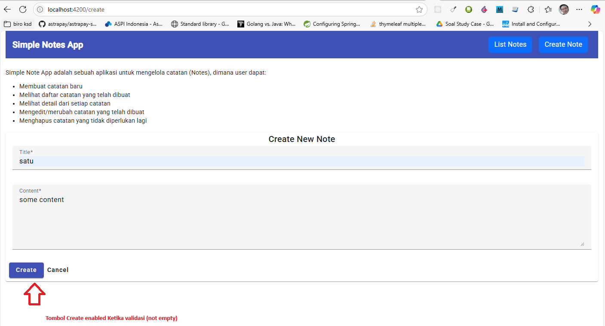
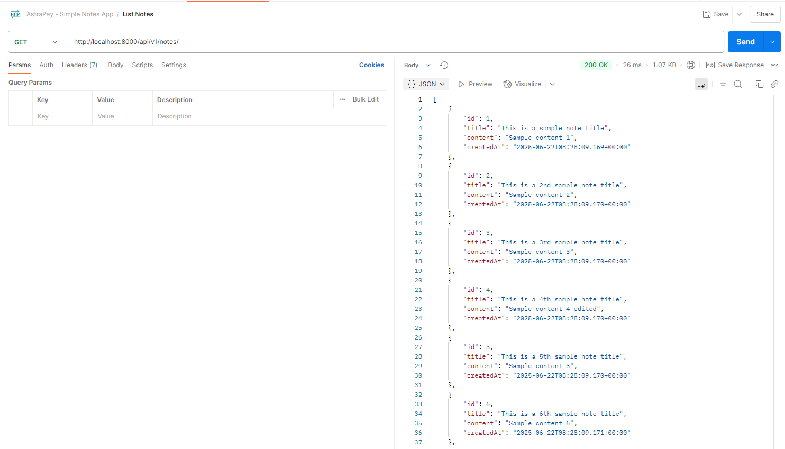
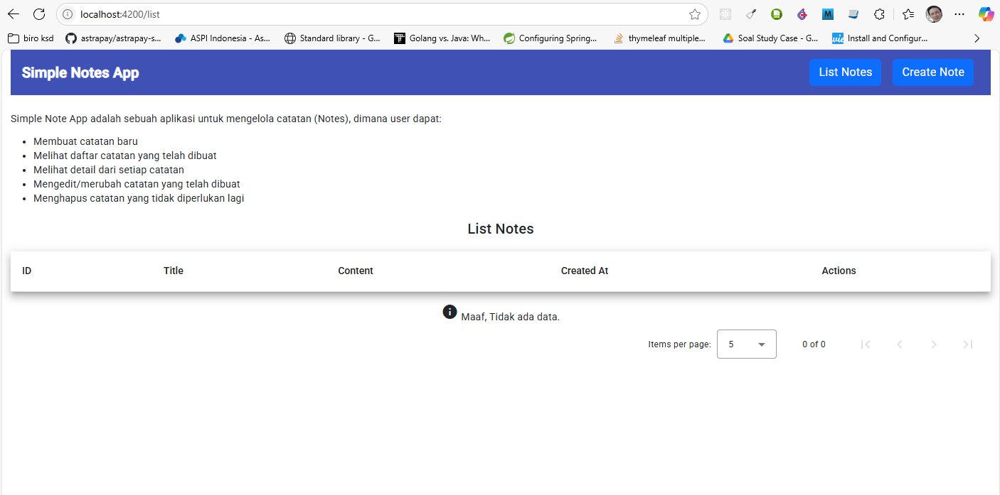
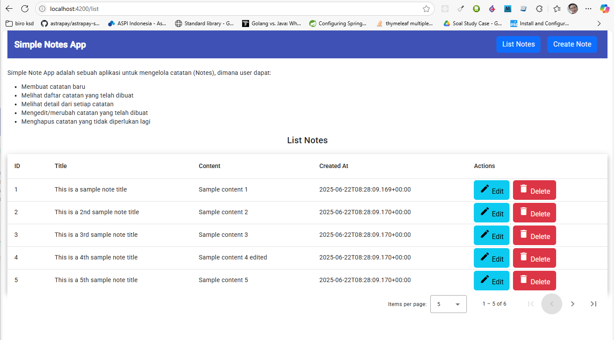
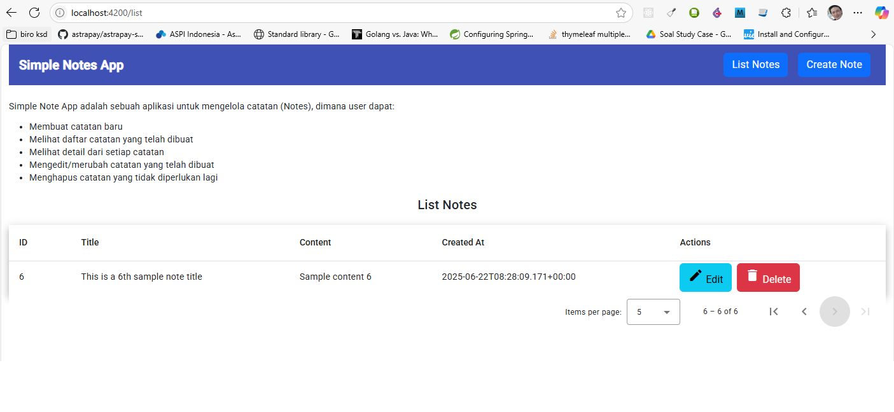
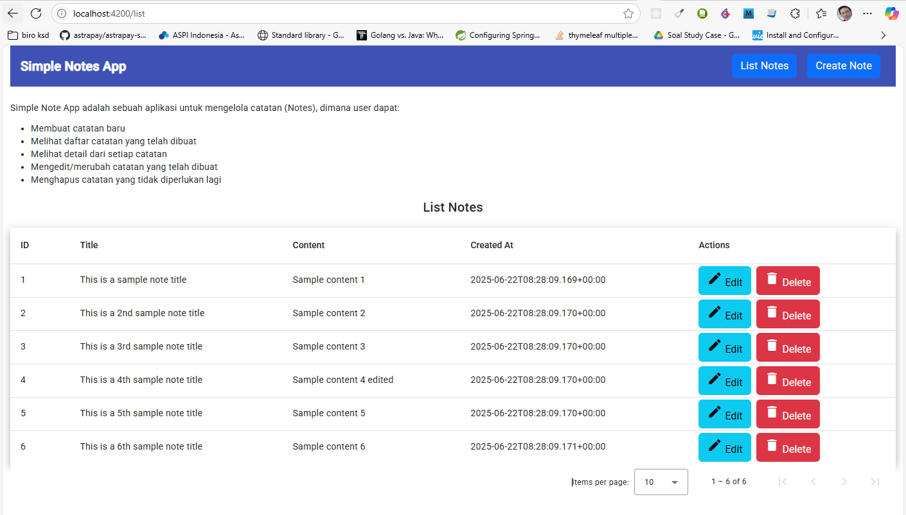

# ASTRAPAY-NOTES-FRONTEND

Projek ini merupakan Angular frontend part dari Astrapay test.

Projek ini menggunakan [Angular CLI](https://github.com/angular/angular-cli) version 19.2.11.

#### Author Info
- Hendra Haliman

## Development server

Untuk menjalankan local dev server, jalankan:

```bash
ng serve
```

Setelah server berjalan, open browser dan navigasi ke `http://localhost:4200/`. 

## Screenshots

### Screenshot sukses validasi



### Postman screenshots



### Halaman tampilan list kosong



### Halaman tampilan berisi 6 notes

Halaman 1:


Halaman 2:





